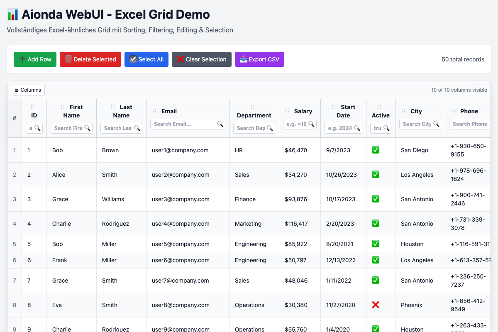

# Aionda WebUI

[](https://github.com/AiondaDotCom/WebUI/actions/workflows/test.yml)

A modern, mobile-first WebUI library built with pure ES6 JavaScript and Tailwind CSS.

## Overview

Aionda WebUI provides a comprehensive set of 25 UI components designed for building complex desktop applications while maintaining responsive design principles. With minimal code, you can create sophisticated interfaces that work seamlessly across devices.

## ✨ Features

- 🎯 **25 Production-Ready Components** - Complete component library across 7 categories
- 📱 **Mobile-First** - Responsive design out of the box  
- ⚡ **Pure ES6** - No build steps required, works directly in browsers
- 🎨 **Tailwind CSS** - Utility-first styling with customizable themes
- 🏗️ **MVVM Architecture** - Reactive data binding and state management
- 📦 **Minimal Code** - Simple, declarative API
- 🔧 **Zero Dependencies** - Self-contained, no external libraries required
- ✅ **367 Tests** - Comprehensive test suite with 100% component coverage
- 📚 **Auto-Generated Documentation** - Complete docs with live examples

## 🚀 Quick Start

### Installation

```bash
npm install @aionda/webui
```

**Or simply via Script Tag (no npm required!):**
```html
<script src="https://cdn.tailwindcss.com"></script>
<link rel="stylesheet" href="dist/aionda-webui.css">
<script src="dist/aionda-webui.js"></script>
```

### Basic Usage

```javascript
// Ready to use immediately with script tag!
const panel = new AiondaWebUI.Panel({
  title: 'My Application',
  width: 400,
  height: 300,
  collapsible: true
});

// Add a button
const button = new AiondaWebUI.Button({
  text: 'Click Me',
  variant: 'primary',
  handler: () => alert('Hello Aionda WebUI!')
});

panel.add(button);
panel.renderTo('#app');
```

## 📦 Component Categories

### Form Components (8)
- **Button** - Multi-variant buttons with icons and states
- **TextField** - Text input with validation and formatting  
- **NumberField** - Numeric input with spinners
- **Checkbox** - Boolean input with switch variants
- **Radio/RadioGroup** - Single selection inputs
- **ComboBox** - Dropdown with search and remote data
- **TextArea** - Multi-line text input
- **DateField** - Date picker input

### Layout Components (2)
- **Panel** - Container with header and collapsible body
- **Window** - Draggable, resizable windows with modal support

### Data Components (3)
- **Grid** - Excel-like grid with sorting, filtering, editing
- **Tree** - Hierarchical data display with drag & drop
- **Form** - Form management with validation and layout

### Navigation Components (3)
- **Menu** - Navigation menus with submenus
- **MenuItem** - Individual menu items with icons
- **Toolbar** - Action toolbars with button groups

### Feedback Components (2)
- **Toast** - Temporary notification messages
- **MessageBox** - Modal dialogs for alerts and confirmations

### Utility Components (2)
- **DateField** - Advanced date selection
- **ThemeToggle** - Light/dark mode switching

### Core Components (5)
- **Component** - Base class for all components
- **EventEmitter** - Event system
- **Store** - Data management with filtering/sorting
- **I18n** - Internationalization support
- **SecurityUtils** - XSS prevention and input sanitization

## 🎮 Live Examples

### Window Demo - Advanced Window Management


Comprehensive window system with dragging, resizing, modal dialogs, and window management.

**[🔗 View Demo](examples/window-demo/index.html)**

### Excel-like Grid with Advanced Features


Interactive data grid with sorting, filtering, cell editing, column resizing, and row selection.

**[🔗 View Demo](examples/excel-grid/index.html)**

### Comprehensive Form System


Complete form with validation, multiple field types, and real-time event logging.

**[🔗 View Demo](examples/form-demo/index.html)**

### Advanced Components Showcase


Complex components including tree views, advanced grids, and specialized inputs.

**[🔗 View Demo](examples/advanced-components/index.html)**

### Basic Components Gallery


Fundamental UI elements including buttons, panels, and basic form controls.

**[🔗 View Demo](examples/basic/index.html)**

## 📚 Documentation

### **[📖 Complete Documentation](docs/)**
- **[🚀 Getting Started](docs/getting-started.md)** - Installation and first steps
- **[🧩 Components](docs/components/)** - Complete component reference  
- **[⚙️ API Reference](docs/api/)** - Core API documentation
- **[💡 Examples](docs/examples/)** - Working examples and patterns
- **[📘 Advanced Guides](docs/guides/)** - Architecture and best practices

### Key Documentation Features
- **Auto-generated from JSDoc** - Always up-to-date with source code
- **Live examples** with working code snippets
- **Mobile-optimized** documentation
- **Cross-platform** compatible links

## 🏗️ Architecture

### Component System
```javascript
// All components extend the base Component class
class MyComponent extends AiondaWebUI.Component {
  createTemplate() {
    return '<div class="my-component">Hello World</div>';
  }
}
```

### Event-Driven
```javascript
// Components communicate via events
button.on('click', () => {
  grid.reload();
  toast.show('Data refreshed!');
});
```

### Data Binding
```javascript
// Reactive data management
const store = new AiondaWebUI.Store({
  data: userData,
  sorters: [{ property: 'name', direction: 'ASC' }]
});

const grid = new AiondaWebUI.Grid({ store });
store.add(newUser); // Grid updates automatically
```

## 🧪 Testing

```bash
npm test                # Run all 367 tests
npm run test:watch     # Watch mode
npm run test:coverage  # Coverage report
```

**Test Coverage:**
- ✅ **367 tests** across 11 test suites
- ✅ **100% component coverage**
- ✅ **Core functionality** - EventEmitter, Component, Store
- ✅ **UI interactions** - clicks, validation, events
- ✅ **Edge cases** - null handling, error conditions

## 🔧 Development

### Building
```bash
node build.js
```
Generates:
- `dist/aionda-webui.js` (49.7 KB)
- `dist/aionda-webui.min.js` (38.7 KB)

### Documentation Generation
```bash
npm run docs:generate
```
Auto-generates documentation from JSDoc comments.

## 📜 License

MIT License - see [LICENSE](LICENSE) for details.

## 🤝 Contributing

1. Fork the repository
2. Create a feature branch
3. Make changes with tests
4. Update documentation
5. Submit a pull request

## 🌟 Status: Production Ready

**All development phases completed:**
- ✅ **Phase 1:** Core architecture and basic components
- ✅ **Phase 2:** Data components (Grid, Tree, Forms)  
- ✅ **Phase 3:** Advanced components (Windows, Menus)
- ✅ **Phase 4:** Documentation and testing system

**Framework is ready for production use!**

## 🚀 Get Started

Ready to build amazing UIs? **[Start with our Getting Started guide](docs/getting-started.md)** or explore the **[live examples](examples/)**.

---

**Built with ❤️ by the Aionda team**