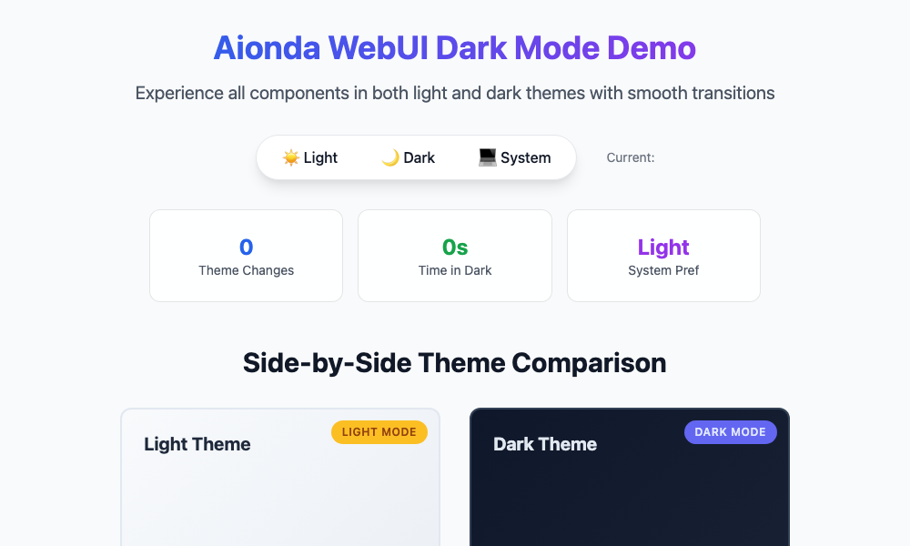
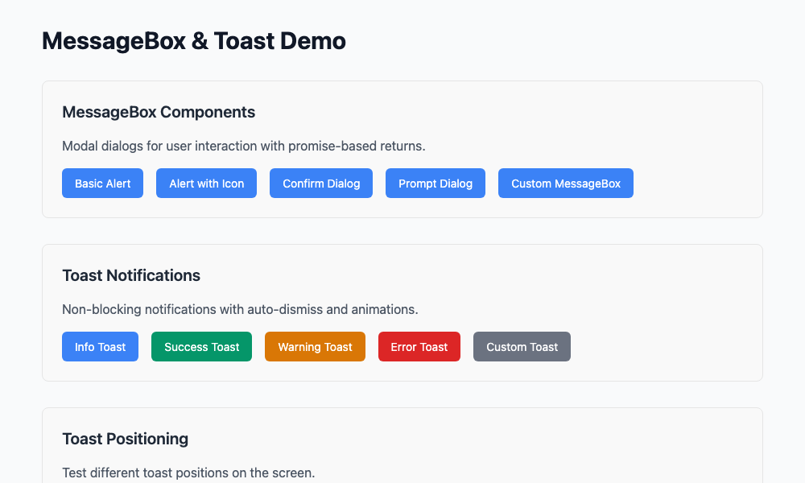

# Aionda WebUI

[](https://github.com/AiondaDotCom/WebUI/actions/workflows/test.yml)

A modern, mobile-first WebUI library built with pure ES6 JavaScript and Tailwind CSS.

## Overview

Aionda WebUI provides a comprehensive set of UI components designed for building complex desktop applications while maintaining responsive design principles. With minimal code, you can create sophisticated interfaces that work seamlessly across devices.

## Features

- 🎯 **140+ Components** - Comprehensive component library
- 📱 **Mobile-First** - Responsive design out of the box
- ⚡ **Pure ES6** - No build steps required, works directly in browsers
- 🎨 **Tailwind CSS** - Utility-first styling with customizable themes
- 🏗️ **MVVM Architecture** - Reactive data binding and state management
- 📦 **Minimal Code** - Simple, declarative API
-  **Zero Dependencies** - Self-contained, no external libraries required

## Live Examples

### Excel-like Grid with Advanced Features


Interactive data grid with sorting, filtering, cell editing, column resizing, and row selection

**Demo:** [excel-grid/index.html](examples/excel-grid/index.html)

### Comprehensive Form System


Complete form with validation, multiple field types, and real-time event logging

**Demo:** [form-demo/index.html](examples/form-demo/index.html)

### Component Showcase


Complete overview of all available UI components and their features

**Demo:** [comprehensive-showcase/index.html](examples/comprehensive-showcase/index.html)

### Dark Mode Toggle



Theme switching demonstration with dark and light mode support

**Demo:** [dark-mode-demo/index.html](examples/dark-mode-demo/index.html)

### Toolbar Components


Interactive toolbar with buttons, separators, and layout options

**Demo:** [toolbar-demo/index.html](examples/toolbar-demo/index.html)

### MessageBox and Toast Notifications



Modal dialogs and toast notifications with various styles and animations

**Demo:** [messagebox-toast-demo/index.html](examples/messagebox-toast-demo/index.html)

### Advanced UI Components


Complex components including tree views, advanced grids, and specialized inputs

**Demo:** [advanced-components/index.html](examples/advanced-components/index.html)

### Basic Components


Fundamental UI elements including buttons, panels, and basic form controls

**Demo:** [basic/index.html](examples/basic/index.html)


## Quick Start

### Installation

```bash
npm install @aionda/webui
```

**Or simply via Script Tag (no npm required!):**
```html
<script src="https://cdn.tailwindcss.com"></script>
<link rel="stylesheet" href="dist/aionda-webui.css">
<script src="dist/aionda-webui.js"></script>
```

### Basic Usage

```javascript
// Ready to use immediately with script tag!
const panel = new AiondaWebUI.Panel({
  title: 'My Application',
  width: 400,
  height: 300,
  collapsible: true
});

// Add a button
const button = new AiondaWebUI.Button({
  text: 'Click Me',
  variant: 'primary',
  handler: () => alert('Hello Aionda WebUI!')
});

panel.add(button);
panel.renderTo('#app');
```

**Or with ES6 modules:**
```javascript
import { Panel, Button } from '@aionda/webui';

const panel = new Panel({
  title: 'My Application',
  collapsible: true
});
```

### Advanced Grid Example

```javascript
// Create a store with sample data
const userStore = new AiondaWebUI.Store({
  data: [
    { id: 1, name: 'John Doe', email: 'john@example.com', active: true },
    { id: 2, name: 'Jane Smith', email: 'jane@example.com', active: false }
  ]
});

// Create a grid with Excel-like features
const grid = new AiondaWebUI.Grid({
  store: userStore,
  columns: [
    { field: 'name', text: 'Name', flex: 1, sortable: true },
    { field: 'email', text: 'Email', flex: 1, filterable: true },
    { field: 'active', text: 'Active', width: 100, type: 'boolean' }
  ],
  selectionMode: 'multi',
  editable: true,
  sortable: true,
  filterable: true,
  resizable: true
});

grid.renderTo('#grid-container');
```

### Form System Example

```javascript
// Create a comprehensive form
const form = new AiondaWebUI.Form({
  layout: 'vertical',
  items: [
    {
      cmp: 'textfield',
      name: 'name',
      fieldLabel: 'Name',
      allowBlank: false
    },
    {
      cmp: 'numberfield',
      name: 'age',
      fieldLabel: 'Age',
      minValue: 0,
      maxValue: 120
    },
    {
      cmp: 'combobox',
      name: 'department',
      fieldLabel: 'Department',
      data: [
        { value: 'eng', text: 'Engineering' },
        { value: 'sales', text: 'Sales' }
      ]
    },
    {
      cmp: 'checkbox',
      name: 'active',
      boxLabel: 'Active Employee',
      variant: 'switch'
    }
  ]
});

form.renderTo('#form-container');
```

## Project Structure

```
typeui/
├── packages/
│   ├── core/           # Core framework (MVVM, data binding)
│   ├── components/     # UI components
│   ├── themes/         # Tailwind themes
│   └── utils/          # Utilities
├── examples/           # Demo applications
└── docs/              # Documentation
```

## Component Library

### Layout Components
- **Panel** - Base container with header, toolbar, content areas
- **Border Layout** - North, south, east, west, center regions  
- **Tab Panel** - Multi-tab interface
- **Accordion** - Collapsible sections
- **Card Layout** - Wizard-style navigation

### Data Components
- **Grid** - Advanced data grid with sorting, filtering, grouping
- **Tree** - Hierarchical data display
- **List View** - Simple list display with templates
- **Pivot Grid** - Analytics and cross-tabulation

### Form Components
- **Form Panel** - Complete form management
- **Text Field** - Text input with validation
- **Combo Box** - Dropdown with search and remote data
- **Date Field** - Date picker with calendar
- **Button** - Action triggers with variants and states

### Menu & Toolbar
- **Toolbar** - Button containers
- **Menu** - Context and dropdown menus
- **Button Group** - Related button collections

## Development

### Prerequisites
- Node.js 18+
- npm or yarn

### Setup
```bash
git clone https://github.com/your-org/typeui.git
cd typeui
npm install
npm run dev
```

### Building
```bash
npm run build
```

### Testing
```bash
npm test
```

## Browser Support

- Chrome 90+
- Firefox 88+
- Safari 14+
- Edge 90+

## Contributing

We welcome contributions! Please see our [Contributing Guide](CONTRIBUTING.md) for details.

## License

**MIT License**

© 2025 Aionda GmbH. This project is licensed under the MIT License - see the [LICENSE](LICENSE) file for details.

## Roadmap

- ✅ Phase 1: Core architecture and basic components
- 🔄 Phase 2: Data components (Grid, Tree, Forms)
- 📋 Phase 3: Advanced components (Windows, Menus)
- 📋 Phase 4: Enterprise features (Pivot Grid, Analytics)

## Support

- 📖 [Homepage](https://aionda.com)
