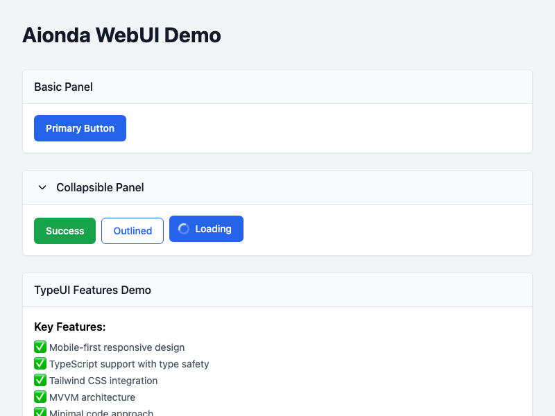

## Live Examples

### Excel-like Grid with Advanced Features

Interactive data grid with sorting, filtering, cell editing, column resizing, and row selection

**Demo:** [excel-grid/index.html](../examples/excel-grid/index.html)

### Comprehensive Form System

Complete form with validation, multiple field types, and real-time event logging

**Demo:** [form-demo/index.html](../examples/form-demo/index.html)

### Component Showcase

Complete overview of all available UI components and their features

**Demo:** [comprehensive-showcase/index.html](../examples/comprehensive-showcase/index.html)

### Dark Mode Toggle

Theme switching demonstration with dark and light mode support

**Demo:** [dark-mode-demo/index.html](../examples/dark-mode-demo/index.html)

### Toolbar Components

Interactive toolbar with buttons, separators, and layout options

**Demo:** [toolbar-demo/index.html](../examples/toolbar-demo/index.html)

### MessageBox and Toast Notifications

Modal dialogs and toast notifications with various styles and animations

**Demo:** [messagebox-toast-demo/index.html](../examples/messagebox-toast-demo/index.html)

### Advanced UI Components

Complex components including tree views, advanced grids, and specialized inputs

**Demo:** [advanced-components/index.html](../examples/advanced-components/index.html)

### Basic Components

Fundamental UI elements including buttons, panels, and basic form controls

**Demo:** [basic/index.html](../examples/basic/index.html)